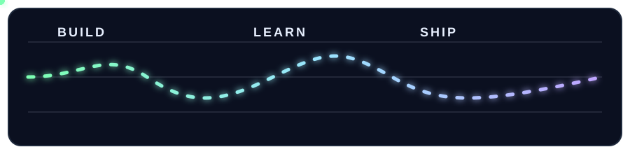

  

  

  

  

---

 

"01" — ABOUT ME

I'm Luminous Halder Alex, a Full-Stack Web Developer passionate about building modern, responsive and high-performance web applications.

I enjoy taking an idea from:

CONCEPT
   ↓
DESIGN
   ↓
DEVELOPMENT
   ↓
TESTING
   ↓
DEPLOYMENT
   ↓
REAL PRODUCT

My development journey is continuously evolving. I'm learning new technologies, experimenting with modern architectures and improving the way I build software.

My Core Interests

"Web Development" · "UI/UX" · "Full-Stack Engineering" · "Automation" · "Performance" · "Security" · "System Design"

 

---

"02" — MY DEVELOPMENT WORLD

                         ┌───────────────┐
                         │    IDEAS      │
                         └───────┬───────┘
                                 │
                                 ▼
                       ┌─────────────────┐
                       │     UI / UX     │
                       └────────┬────────┘
                                │
                                ▼
                  ┌──────────────────────────┐
                  │        FRONTEND          │
                  │ React • Next • TS • JS   │
                  └────────────┬─────────────┘
                               │
                               ▼
                  ┌──────────────────────────┐
                  │         BACKEND          │
                  │ Node • Express • PHP     │
                  └────────────┬─────────────┘
                               │
                               ▼
                  ┌──────────────────────────┐
                  │        DATABASE          │
                  │ MongoDB • MySQL • Firebase│
                  └────────────┬─────────────┘
                               │
                               ▼
                  ┌──────────────────────────┐
                  │       DEPLOYMENT         │
                  │ Git • GitHub • Vercel    │
                  └──────────────────────────┘

 

---

"03" — TECHNOLOGY STACK

⚡ Frontend

 ⚙️ Backend

 🗄️ Database

 🛠️ Tools & Development

 

---

"04" — TECHNOLOGY JOURNEY

🟢 Comfortable With

HTML                  ████████████████████  100%
CSS                   ████████████████████  100%
JavaScript            ████████████████████  100%
React.js              ███████████████████░   90%
Tailwind CSS          ███████████████████░   90%
Bootstrap             █████████████████░░░   85%
Java                  ████████████████░░░░   80%
Python                ████████████████░░░░   80%
PHP                   ████████████████░░░░   80%

🔵 Growing With

Next.js               █████████████████░░░   LEARNING
TypeScript            █████████████████░░░   LEARNING
Node.js               ████████████████░░░░   LEARNING
Express.js            ███████████████░░░░░   LEARNING
MongoDB               ███████████████░░░░░   LEARNING
Firebase              ███████████████░░░░░   LEARNING
REST API              ███████████████░░░░░   LEARNING
Web Security          █████████████░░░░░░░   EXPLORING
System Design         ████████████░░░░░░░░   EXPLORING

«These levels are intentionally not permanent. They evolve as I learn.»

---

---

"05" — FRONTEND UNIVERSE

<table>
<tr>
<td align="center" width="25%">HTML5

Structure

</td><td align="center" width="25%">CSS3

Design

</td><td align="center" width="25%">JavaScript

Logic

</td><td align="center" width="25%">TypeScript

Safety

</td>
</tr><tr>
<td align="center">React.js

Components

</td><td align="center">Next.js

Full-Stack React

</td><td align="center">Tailwind

Utility UI

</td><td align="center">Bootstrap

Rapid UI

</td>
</tr>
</table> 

---

"06" — BACKEND & DATA

              ┌─────────────────────┐
              │       CLIENT        │
              └──────────┬──────────┘
                         │
                         ▼
              ┌─────────────────────┐
              │      REST API       │
              └──────────┬──────────┘
                         │
             ┌───────────┼───────────┐
             ▼           ▼           ▼
         Node.js      Express      PHP
             │           │           │
             └───────────┼───────────┘
                         ▼
              ┌─────────────────────┐
              │      DATABASE       │
              ├─────────────────────┤
              │ MongoDB             │
              │ MySQL               │
              │ Firebase            │
              └─────────────────────┘

 

---

"07" — SELECTED PROJECTS

🎮 AX ESPORTS

Esports Management & Automation Platform

A complete esports platform designed for tournament management, competitive workflows and automation.

"Automation" · "Tournament Management" · "Esports" · "Web Development"

LIVE → https://axesports.rf.gd/

---

🏫 SCHOOL MANAGEMENT SYSTEM

Complete Educational Management Platform

A multi-panel educational ecosystem.

ADMIN
 ├── PRINCIPAL
 ├── REGISTER
 ├── EXAM CELL
 ├── TEACHER
 └── STUDENT

"Management System" · "Role Based Access" · "Academic System"

LIVE → https://ax-school-erp.rf.gd/

---

🌐 PERSONAL PORTFOLIO

Developer Portfolio & Admin System

A modern React-based personal portfolio with project management functionality.

"React" · "JavaScript" · "Full-Stack"

LIVE → https://ax-alex.vercel.app/

---

🔢 NUMBER COUNTER

Minimal React frontend project.

"React" · "JavaScript" · "CSS"

LIVE → https://ax-counter.vercel.app/

 

---

"08" — TERMINAL

┌──(alex㉿developer)-[~]
└─$ whoami

LUMINOUS HALDER ALEX

┌──(alex㉿developer)-[~]
└─$ stack --show

React.js
Next.js
TypeScript
JavaScript
Node.js
Express.js
Python
Java
PHP
Tailwind CSS
Bootstrap
MongoDB
MySQL
Firebase

┌──(alex㉿developer)-[~]
└─$ status

● Learning
● Building
● Experimenting
● Improving

┌──(alex㉿developer)-[~]
└─$ motivation

Build → Break → Fix → Learn → Repeat

┌──(alex㉿developer)-[~]
└─$ _

---

"09" — CURRENTLY LEARNING

NEXT.JS              → █████████████████░░░  IN PROGRESS
TYPESCRIPT           → █████████████████░░░  IN PROGRESS
NODE.JS              → ███████████████░░░░░  IN PROGRESS
EXPRESS.JS            → ███████████████░░░░░  IN PROGRESS
MONGODB              → ███████████████░░░░░  IN PROGRESS
FIREBASE              → ███████████████░░░░░  IN PROGRESS
WEB SECURITY          → █████████████░░░░░░░  EXPLORING
SYSTEM DESIGN         → ████████████░░░░░░░░  EXPLORING

 

---

"10" — GITHUB ANALYTICS

  

  

 

---

"11" — CONTRIBUTION FLOW

   

---

"12" — DEVELOPMENT LOOP

              ┌──────────┐
             │  THINK   │
             └────┬─────┘
                  ↓
             ┌──────────┐
             │  DESIGN  │
             └────┬─────┘
                  ↓
             ┌──────────┐
             │  BUILD   │
             └────┬─────┘
                  ↓
             ┌──────────┐
             │   TEST   │
             └────┬─────┘
                  ↓
             ┌──────────┐
             │  DEBUG   │
             └────┬─────┘
                  ↓
             ┌──────────┐
             │ IMPROVE  │
             └────┬─────┘
                  ↓
             ┌──────────┐
             │   SHIP   │
             └────┬─────┘
                  │
                  └───────────────→ REPEAT

---

"13" — EDUCATION

🎓 Diploma in Computer Science & Technology

Currently Studying

"Computer Science" · "Software Development" · "Web Technologies"

 🏫 Secondary School Certificate

Bangladesh Adventist Seminary School and College

"2023 — 2024"

 🏫 High School

Khulna Govt. Model School & College

"2016 — 2022"

---

  
---

"14" — MY PHILOSOPHY

  

        ┌─────────┐
        │  LEARN  │
        └────┬────┘
             ↓
        ┌─────────┐
        │  BUILD  │
        └────┬────┘
             ↓
        ┌─────────┐
        │ CREATE  │
        └────┬────┘
             ↓
        ┌─────────┐
        │  BREAK  │
        └────┬────┘
             ↓
        ┌─────────┐
        │   FIX   │
        └────┬────┘
             ↓
        ┌─────────┐
        │ IMPROVE │
        └────┬────┘
             ↓
        ┌─────────┐
        │ REPEAT  │
        └─────────┘

---

"15" — LET'S CONNECT

  

  

📧 alexhalder2007@gmail.com

📍 Khulna, Bangladesh

  

  

  

